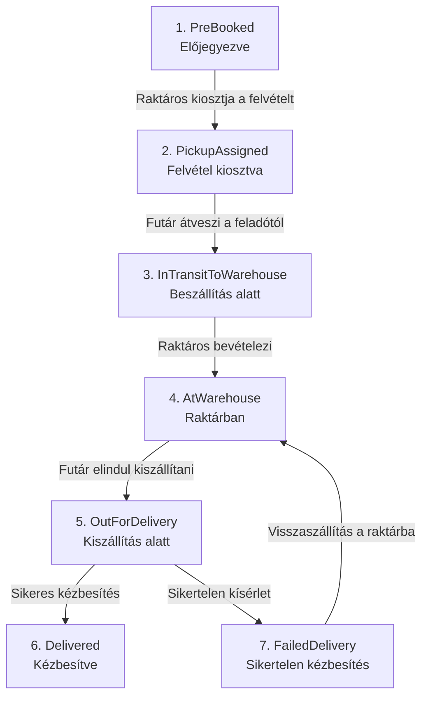

# Csomagkezelő rendszer – Specifikáció

## 1. A feladat leírása

A feladat egy webes csomagkezelő rendszer készítése egy kisebb regionális futárcég számára. A cég saját futárokkal szállít, és egy központi elosztó raktárral rendelkezik. A rendszer célja, hogy a csomagok teljes útja – az előjegyzéstől a kézbesítésig – egy helyen nyomon követhető és kezelhető legyen, és a folyamat minden szereplője (feladó, címzett, futár, raktáros, adminisztrátor) a saját feladatához szükséges funkciókat érje el.

### A szállítási folyamat menete:
 1. **Csomag előjegyzése:** A feladó előjegyzi a csomagot a rendszerben, megadva a szállítási adatokat, méretet, valamint kiválasztva a tervezett felvétel napját és idősávját. A rendszer rögzíti az igényt, és csomagazonosítót generál.
 
 2. **Raktáros értesítése és feladatkiosztás:** Az új előjegyzés megjelenik a raktáros felületén (értesítés vagy új igény lista formájában). A raktáros kiválasztja és hozzárendeli a felvételi feladatot az illetékes futárhoz.
 
 3. **Csomagfelvétel és beszállítás:** A futár megkapja a feladatot, elindul a csomagért, átveszi azt a feladótól, majd a rendszerben rögzíti a felvételt, majd a csomagot az elosztó raktárba szállítja.

 4. **Raktári bevételezés:** A raktáros az elosztó raktárban ellenőrzi és bevételezi a beérkezett csomagot, majd hozzárendeli a kiszállítást végző futárhoz
 
 5. **Kiszállítás és kézbesítés:** A kiszállító futár elindul a csomaggal, átadja a címzettnek, és a kézbesítést rögzíti a rendszerben.
 

Csomagot vendégként, regisztráció nélkül is fel lehet adni, illetve lehet kapni. Ebben az esetben a feladó és a címzett csomagazonosítóval követheti a csomag útját. Aki regisztrál, az a saját feladott és érkező csomagjait, valamint a korábbi küldéseit és fogadásait is látja, és az előjegyzett csomag adatain (átvételi idősáv, szállítási cím, méret) a tervezett felvétel előtti naptári napig változtathat.

 Egy futár egyszerre több csomagot is kezelhet, akár felvételt és kiszállítást vegyesen, és minden felvételt és kézbesítést a rendszerben rögzít. 

A rendszert egy adminisztrátor felügyeli, aki minden csomagot és felhasználót lát, módosíthatja az adataikat, illetve törölheti őket, bármikor átrendelheti a csomagokat a futárok között, és statisztikákat néz a raktár kihasználtságáról és a futárok teljesítményéről.

## 2. Szereplők

- **Vendég:** Csomagot jegyezhet elő feladóként, csomagazonosító alapján követheti a küldemény státuszát (feladóként és címzettként), valamint regisztrálhat fiókot

- **Regisztrált felhasználó:** Bejelentkezés után látja a feladott és érkező csomagjait és az előzményeket, módosíthatja az előjegyzett csomagok adatait a megadott határidőig

- **Futár:** Látja a számára kiosztott napi feladatokat (felvétel és kiszállítás vegyesen), rögzíti a státuszváltásokat (felvétel megtörtént, sikertelen felvétel/kézbesítés, kézbesítve), valamint megtekinti saját szállítási statisztikáit és történetét napi, heti és havi bontásban.  

- **Raktáros:** bevételezi beérkező csomagokat, kiosztja a felvételt és a kiszállítást a futároknak, nyomon követi a raktárban lévő és futárnál lévő csomagállományt

- **Adminisztrátor:** Teljes hozzáféréssel bír: kezeli a felhasználókat és jogosultságaikat, a raktárost felülbírálva bármikor átoszthatja a futári feladatokat, valamint analitikai kimutatásokat ér el (raktárkapacitás, forgalom, futári hatékonyság)

## 3. Funkcionális követelmények

**Vendég funkciók**
- Csomag előjegyzése: Űrlap kitöltése (feladó neve, címe, telefonszáma; címzett neve, címe, e-mail címe, telefonszáma; csomag méretének kiválasztása, a kívánt felvételi nap és idősáv). A mentés után a rendszer generál egy egyedi azonosítót (Tracking Number) és letölthető csomagcímkét biztosít.

-  Publikus csomagnapló és követés: Keresés csomagazonosító alapján. Megjeleníti az aktuális státuszt és az eddigi állapotváltások időbélyeges történetét (személyes adatok nélkül).

-  Regisztráció: Felhasználói fiók létrehozása (név, e-mail, jelszó, telefonszám, számlázási és szállítási/felvételi cím).

**Regisztrált felhasználó funkciói**

- Be- és kijelentkezés: JWT alapú bejelentkezés
- Aktív csomagok listája: Külön jelölve a felhasználó által feladott és a felhasználó e-mail címe/azonosítója alapján hozzá társított érkező csomagokról.
-  Küldési és fogadási előzmények.
- Előjegyzett csomag módosítása (idősáv, cím, méret) legkésőbb a felvétel előtti naptári napon.
-  Felhasználói fiók törlése

**Futár**

- Saját feladatok listája (felvétel és kiszállítás egyszerre is).
- Felvétel és kézbesítés rögzítése.
- Saját szállítási történet napi, heti és havi bontásban.

**Raktáros**

- Beérkezett csomag bevételezése.
- Felvétel és kiszállítás kiosztása futárnak; módosítás, amíg a futár el nem indult.
- A raktárban lévő és a futárokhoz rendelt csomagok listája.

**Adminisztrátor**

- Csomagok, futárok, raktárosok és felhasználók listázása, módosítása, törlése.
- Csomag futárhoz rendelésének módosítása bármikor.
- Statisztikák: raktár aktuális és korábbi kihasználtsága, csomagok száma naponta, átlagos kiszállítási idő.

## 4. A csomag állapotai

A csomag az életciklusa során az alábbi hét állapoton megy keresztül:

1. **PreBooked** – A feladó rögzítette az előjegyzést, a csomag felvételre vár.
2. **PickupAssigned** – A raktáros hozzárendelte a felvételt egy futárhoz.
3. **InTransitToWarehouse** – A futár felvette a csomagot a feladótól, a raktár felé tart vele.
4. **AtWarehouse** – A csomag beérkezett az elosztó raktárba, a raktáros bevételezte.
5. **OutForDelivery** – A raktáros kiosztotta a csomagot kiszállításra, a futár elindult a címzetthez.
6. **Delivered** – A futár sikeresen átadta a küldeményt a címzettnek (végállapot).
7. **FailedDelivery** – Sikertelen kézbesítési kísérlet (pl. a címzett nem elérhető)

Minden állapotváltás időbélyeggel bekerül a csomag előzményei közé; ebből épül a követés és a statisztika.

## 5. Fontos szabályok

- Az előjegyzett csomag a tervezett felvétel előtti naptári nap végéig módosítható.
- Ha a futár elindult a csomagért vagy a csomaggal, a raktáros már nem módosíthatja a kiosztást; az admin igen.
- Egy futárnak egyszerre több feladata is lehet, felvétel és kiszállítás vegyesen.
- A nyilvános követés nem mutat személyes adatot.

## 6. Adatmodell

| Entitás | Fő mezők |
| --- | --- |
| User | Id, UserName, FirstName, LastName, Email, PasswordHash, PhoneNumber, Address, Role (Registered, Courier, WarehouseKeeper, Admin) |
| Package | Id, TrackingNumber, SenderId?, SenderName, SenderAddress, RecipientId?, RecipientName, RecipientAddress, RecipientEmail, Size, Weight, Value, PickupDate, PickupSlot, Status, CreatedAt |
| CourierTask | Id, PackageId, CourierId, TaskType (Pickup, Delivery), Status (Assigned, InProgress, Completed), AssignedAt, CompletedAt |
| PackageStatusHistory | Id, PackageId, Status, ChangedById, ChangedAt |
| WarehouseLog | Id, Date, PackageCount |

A kérdőjeles mezők vendég esetén üresek. A futár a CourierTask-on keresztül kapcsolódik a csomaghoz, így a felvételt és a kiszállítást más-más futár is végezheti. Az eredeti UML-hez képest: TruckingNumber → TrackingNumber, CreateAt → CreatedAt, új PickupSlot mező, a Package.CourierId helyett CourierTask.

## 7. Technológia és nem funkcionális követelmények

- C# (ASP.NET Core Web API) backend, SQL adatbázis Entity Framework Core-ral
- Jelszavak hash-elve tárolva, szerepkör alapú jogosultságkezelés.
- React frontend, reszponzív felülettel
